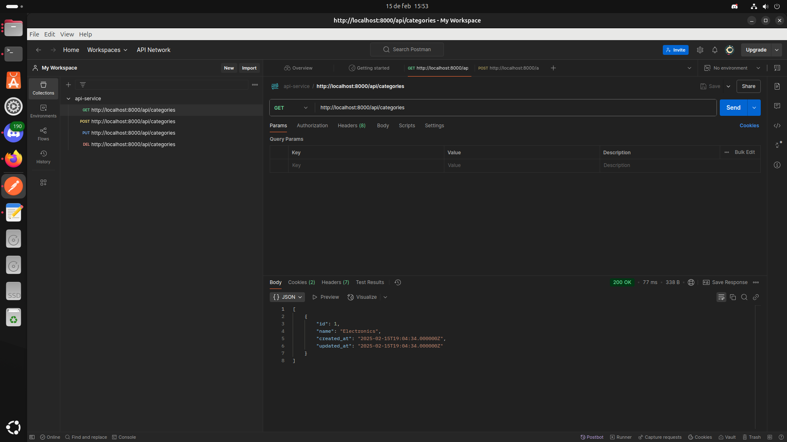
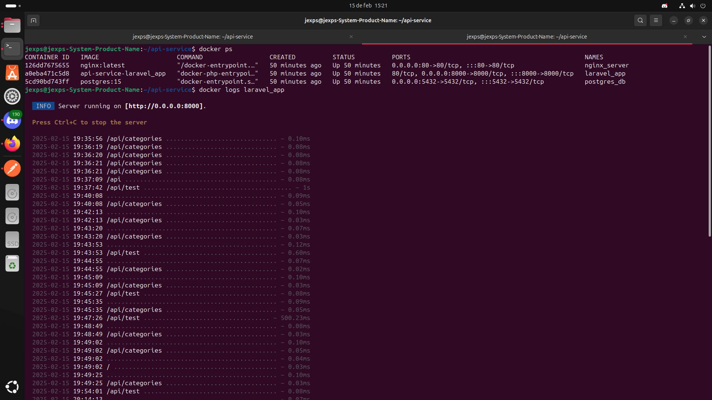
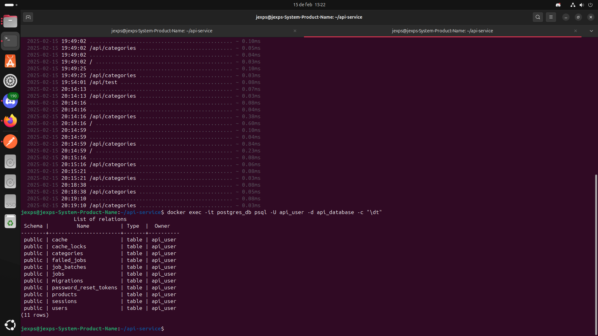

# 📌 Documentación del Microservicio API con Laravel, PostgreSQL y Docker

## 📖 Introducción
Este documento detalla el desarrollo y despliegue de un **API RESTful** con **Laravel**, utilizando **PostgreSQL** como base de datos, **Docker** para la contenerización y despliegue en la nube. Se incluyen pasos clave, problemas encontrados y soluciones aplicadas.

## 📂 Estructura del Proyecto
```plaintext
api-service/
├── app/
├── bootstrap/
├── config/
├── database/
│   ├── migrations/
├── public/
├── routes/
│   ├── api.php
├── storage/
├── tests/
├── Dockerfile
├── docker-compose.yml
├── .env
├── README.md
└── postman_collection.json
└── screenshots
```

## 🚀 Pasos de Implementación

### 1️⃣ Creación del Proyecto Laravel
```bash
composer create-project --prefer-dist laravel/laravel api-service
cd api-service
```

### 2️⃣ Configuración de la Base de Datos PostgreSQL
Se configuró el archivo **.env** con los siguientes valores:
```plaintext
DB_CONNECTION=pgsql
DB_HOST=postgres_db
DB_PORT=5432
DB_DATABASE=api_database
DB_USERNAME=api_user
DB_PASSWORD=secret
```

#### 📸 Capturas de configuración PostgreSQL


### 3️⃣ Creación de Modelos, Migraciones y Controladores
```bash
php artisan make:model Category -mcr
php artisan make:model Product -mcr
```
Se generaron las migraciones y luego se ejecutaron:
```bash
php artisan migrate
```

### 4️⃣ Pruebas con Postman
Se crearon y probaron los **endpoints** con **Postman**, y se exportó la colección en formato JSON:
#### 📥 Exportar colección en Postman:
1. Ir a **Collections**.
2. Seleccionar la colección de la API.
3. Clic en **Export** y elegir el formato JSON.
4. Guardar el archivo como **api-service.postman_collection.json**.

#### 📸 Capturas de pruebas en Postman



### 5️⃣ Dockerización del Proyecto
Se crearon los archivos **Dockerfile** y **docker-compose.yml**.

#### 📌 Dockerfile
#### 📸 Capturas de pruebas Dockerizacion




```Dockerfile
FROM php:8.2-apache

# Instalar dependencias necesarias
RUN apt-get update && apt-get install -y \
    libpq-dev \
    unzip \
    && docker-php-ext-install pdo pdo_pgsql

# Establecer directorio de trabajo
WORKDIR /var/www/html

# Copiar archivos del proyecto
COPY . .

# Instalar Composer
RUN curl -sS https://getcomposer.org/installer | php -- --install-dir=/usr/local/bin --filename=composer

# Instalar dependencias de Laravel
RUN composer install --no-dev --optimize-autoloader

# Dar permisos necesarios
RUN chmod -R 777 storage bootstrap/cache

```

#### 📌 docker-compose.yml
```yaml
version: '3.8'

services:
  # Servicio de la base de datos PostgreSQL
  postgres_db:
    image: postgres:15
    container_name: postgres_db
    restart: always
    environment:
      POSTGRES_DB: api_database
      POSTGRES_USER: api_user
      POSTGRES_PASSWORD: secret
    ports:
      - "5432:5432"
    volumes:
      - postgres_data:/var/lib/postgresql/data

  # Servicio de la aplicación Laravel
  laravel_app:
    build:
      context: .
      dockerfile: Dockerfile
    container_name: laravel_app
    restart: always
    depends_on:
      - postgres_db
    volumes:
      - .:/var/www/html
    environment:
      APP_ENV: local
      APP_DEBUG: true
      DB_CONNECTION: pgsql
      DB_HOST: postgres_db
      DB_PORT: 5432
      DB_DATABASE: api_database
      DB_USERNAME: api_user
      DB_PASSWORD: secret
    command: ["php", "artisan", "serve", "--host=0.0.0.0", "--port=8000"]
    ports:
      - "8000:8000"
    stdin_open: true
    tty: true

  # Servicio de Nginx como proxy reverso
  nginx_server:
    image: nginx:latest
    container_name: nginx_server
    restart: always
    depends_on:
      - laravel_app
    ports:
      - "80:80"
    volumes:
      - ./nginx/default.conf:/etc/nginx/conf.d/default.conf:ro

volumes:
  postgres_data:

```

### 6️⃣ Subir el Código a GitHub
#### 🔐 **Autenticación con GitHub CLI**
Para solucionar el error de autenticación al hacer `git push`, se utilizó **GitHub CLI**:
```bash
gh auth login
```
Esto permitió autenticarse correctamente sin necesidad de ingresar la contraseña manualmente.

#### 📤 Subida del código a GitHub
```bash
git init
git add .
git commit -m "Primer commit: API Laravel"
git branch -M main
git remote add origin https://github.com/JeXps/api-service.git
git push -u origin main
```

### 7️⃣ Despliegue en la Nube
Para desplegar el servicio, se ejecutaron los siguientes comandos:
```bash
docker-compose up -d
```

## 📜 Problemas Encontrados y Soluciones

### ❌ Error: `could not translate host name "postgres_db" to address`
🔹 **Solución:** Se aseguró que los servicios estuvieran corriendo antes de hacer la conexión.
```bash
docker-compose restart
```

### ❌ Error: `git push -u origin main` solicitando contraseña
🔹 **Solución:** Se utilizó **GitHub CLI** (`gh auth login`) en lugar de autenticación con contraseña.

### ❌ Error: `bash: psql: command not found`
🔹 **Solución:** Se instaló `psql` dentro del contenedor:
```bash
docker exec -it laravel_app bash
apt update && apt install -y postgresql-client
```
## ❌ Error: `Se Tuvo varios errores con los dockers ya que no estaban con los datos correctos`
🔹 **Solución:** Se verificaron los datos muchas veces:

## ❌ Error: `La carpeta routes/api.php tuvo varios errores `
🔹 **Solución:** Se verificaron los datos muchas veces:


## ❌ Error: `La carpeta r/app/Providers tuvo varios errores por que faltaban archivos importantes `
🔹 **Solución:** Se verificaron los archivos y se soluciono creandolos manualmente

## 🌍 URL del Servicio Desplegado
*(Aquí se coloca la URL del API en la nube una vez desplegada)*

## 📑 Conclusión
Este proyecto permitió implementar una API RESTful con **Laravel**, **PostgreSQL** y **Docker**, además de realizar pruebas con **Postman** y gestionar el código con **GitHub**. Se resolvieron errores en la configuración y autenticación, garantizando un despliegue exitoso. 🚀

